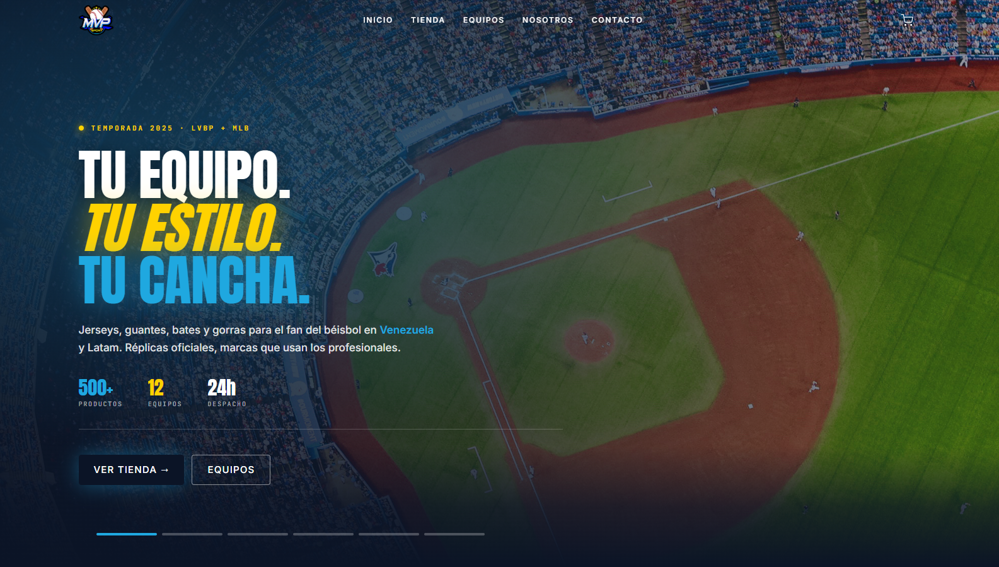

# ⚾ MvpSports

**MvpSports** es una tienda online de ropa y artículos de béisbol orientada al fan casual en Venezuela y Latam. El proyecto ofrece réplicas oficiales de MLB y LVBP, guantes, bates, pelotas y gorras de marcas que usan los profesionales.

> _Gear up. Game on._

Es un MVP (Producto Mínimo Viable) construido como aplicación web de una sola página (SPA) con datos mock, pensado para validar la experiencia de compra antes de integrar un backend real.

---

## 🧱 Stack técnico

| Capa | Tecnología |
|---|---|
| **Framework UI** | React 19 |
| **Lenguaje** | TypeScript |
| **Build tool** | Vite 8 (con React Compiler) |
| **Estilos** | Tailwind CSS v4 (design tokens vía `@theme`) |
| **Enrutamiento** | React Router DOM v7 |
| **Gestión de estado** | Zustand (con persistencia en `localStorage`) |
| **Formularios y validación** | React Hook Form + Zod |
| **Linter** | ESLint + TypeScript ESLint |
| **Package manager** | pnpm |

---

## 🎨 Design system

- **Paleta** alineada con el logo: midnight, cyan, navy, gold, bat-red, ice, vapor.
- **Tipografías**: `Anton` (display/scoreboard), `Inter` (body), `JetBrains Mono` (utility/precios).
- **Signature element**: componente `ScoreLine` (separator tipo "── 01 ─── STARTERS ───") que estructura las secciones principales.

---

## 📄 Licencia

MIT — Hecho con ⚾ en Caracas.

**Diseñado por** [Yofrank](https://my-portfolio-pi-lac-63.vercel.app/) · 2025
